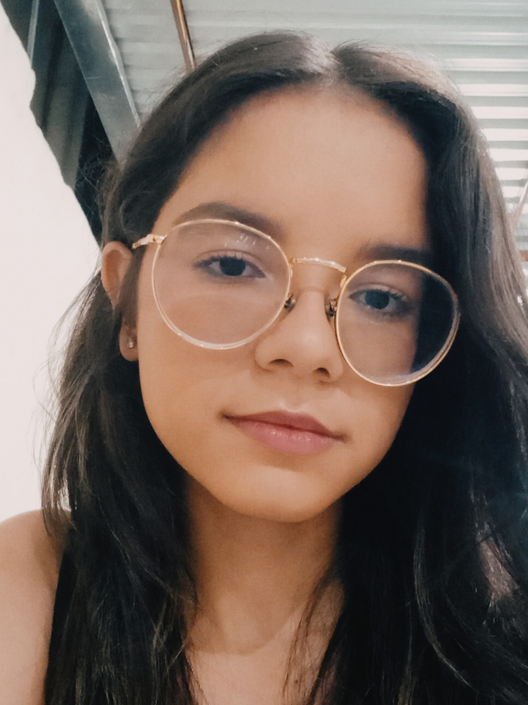

# Dudinha.dev

Minimalista, apaixonada por tecnologia, criatividade e organização!  
Gosto de transformar ideias em experiências visuais bonitas e funcionais.

---

### 💻 Habilidades

- 🌐 HTML, CSS, JavaScript  
- 🛠️ Git, Figma  
- ☕ Também sei usar Java

---

### 🎯 Atualmente focada em:
Desenvolvimento Web, especialmente front-end com HTML e CSS.

---

### 🛠️ Linguagens e Ferramentas

  
  
  
  
  
  

---

### 📈 Estatísticas do GitHub

  
  

---

### ✨ Repositórios em destaque
Confira meus projetos aqui no GitHub! Em breve, mais novidades.
